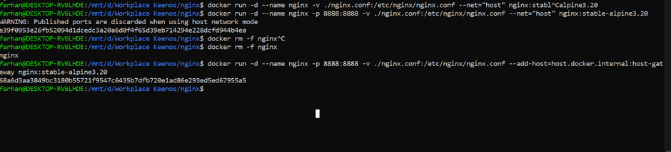
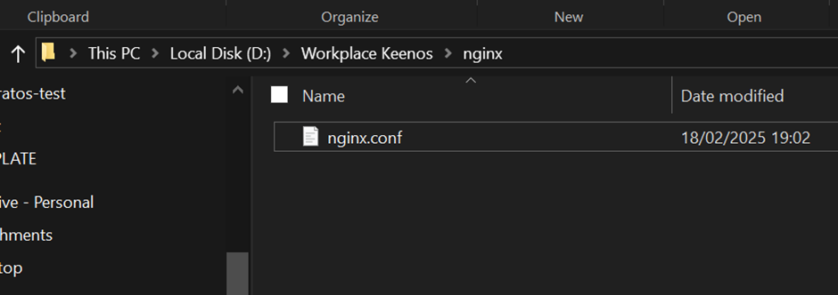
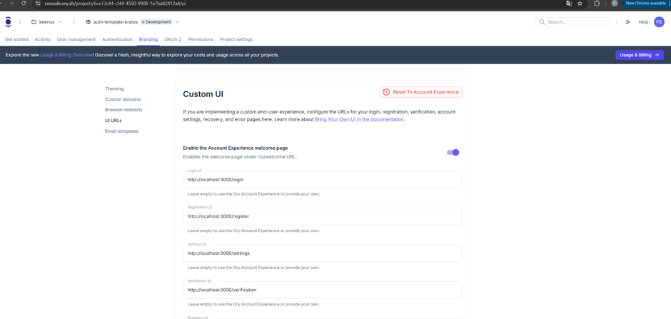

-untuk menjalankan ory kratos di docker:
1.docker-compose up -d kratos mailslurper
2.docker-compose run --rm kratos-migrate
3.docker-compose up -d

- ada error ketika mengganti identity schema pada ory self hosted, error terjadi ketika hit admin api all get identities, error itu terjadi karena kratos masih membaca schema yang lama karena db belum dihapus. Jadi harus dihapus dulu db nya

-untuk bisa mengirim cookie dari react(yang dikirim oleh kratos ke react) ke api BE di golang, maka si level domainnya itu harus sama dengan kratosnya. Intinya si golang dan react itu perlu memiliki domain yang sama solusinya yaitu menggunakan nginx dan setup address react dan golang nya itu di addres yang sama(ini scenario jika menggunakan ory cli yg di setup tunnelnya sesuai addres react nya dengan command ini-> ory tunnel --project 71f71fd1-403a-4dad-a453-b30bc86cdb79 --workspace 229e6e0a-518c-4603-8a59-880f3a47625a http://localhost:5173 ). Jadi sebelum disetup nginx agar domain react dan golangnya sama, ketika react mengirim request ke golang, si cookiesnya itu ga dikirim.

-untuk setup nginx nya itu pertama buat dlu folder nginx dimana aja, trs Jalanin ini di terminal pada path folder trsebut nya:
docker run -d --name nginx -p 8888:8888 -v ./nginx.conf:/etc/nginx/nginx.conf --add-host=host.docker.internal:host-gateway nginx:stable-alpine3.20
atau
docker run -d --name nginx -p 8888:8888 -v "D:\Workplace Keenos\nginx\nginx.conf:/etc/nginx/nginx.conf" --add-host=host.docker.internal:host-gateway nginx:stable-alpine3.20

nanti bakal kebuat file seperti ini:

berikut merupakan file nginx.conf nya:
events {}

http {
    server {
        listen 8888;

        # Proxy requests to App 1 (Frontend)
        location / {
            proxy_pass http://host.docker.internal:5173;
            proxy_set_header Host $host;
            proxy_set_header X-Real-IP $remote_addr;
            proxy_set_header X-Forwarded-For $proxy_add_x_forwarded_for;
            proxy_set_header X-Forwarded-Proto $scheme;
        }

        # Proxy requests to App 2 (Backend API)
        location /api/ {
            proxy_pass http://host.docker.internal:8000;
            proxy_set_header Host $host;
            proxy_set_header X-Real-IP $remote_addr;
            proxy_set_header X-Forwarded-For $proxy_add_x_forwarded_for;
            proxy_set_header X-Forwarded-Proto $scheme;
        }
    }
}

Jangan lupa di vite reactnya tambahin ini supaya nginx di docker bisa baca dari host(lokal laptop) nya
"scripts": {
    "dev": "vite --host",
  ..
}  

-Untuk mengsetup ory berjalan untuk development pada fe next-js 12:
Disini menggunakan kode pada artikel ini: https://www.ory.sh/blog/nextjs-authentication-spa-custom-flows-open-source
Step:
1.	Setup ory cli
2.	Buat project
ory create project --name "temp" 
3.	Jalankan command ini: 
-ory tunnel --project <project-id> --workspace <workspace-id> http://localhost:3000
-ory tunnel --project 6ce73c44-cf44-4590-9908-1e7ba82412a4 --workspace 229e6e0a-518c-4603-8a59-880f3a47625a http://localhost:3000
- ory tunnel --project 71f71fd1-403a-4dad-a453-b30bc86cdb79 --workspace 229e6e0a-518c-4603-8a59-880f3a47625a http://localhost:5173
4.	Jalankan ini: 
#set ORY_SDK_URL=http://localhost:4000 # Windows CMD 
$env:ORY_SDK_URL = "http://localhost:4000" # Windows PowerShell

Note:

5.	Edit ini menyesuakan dengan link url fe 

6.	Setting env menyesuaikan dengan url nya:
Contoh jika menggunakan ory network dengan ory tunnel:
NEXT_PUBLIC_ORY_SDK_URL=http://localhost:4000

-Sangat Tidak dianjurkan(security issue) menggunakan api based dalam aplikasi browser, server side app, spa
Src: ory dokumentasi

-Tidak dianjurkan pake ory network di prod, gunakan docker
Src: gpt

-Perbedaan domain browser based ory kratos
Src:https://www.ory.sh/docs/kratos/self-service/flows/user-login?utm_source=chatgpt.com
Ory and your UI must be on the hosted on same top level domain. You can't host Ory and your UI on separate top level domains:
•	ory.bar.com and app.bar.com will work;
•	ory.bar.com and bar.com will work;
•	ory.bar.com and not-bar.com will not work.

